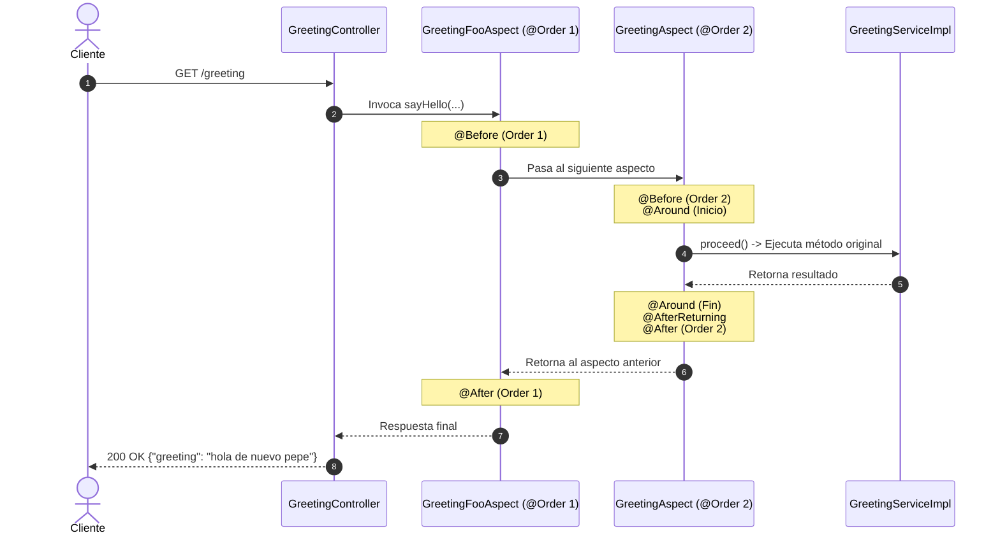

# 🍃 Spring Boot AOP (Aspect-Oriented Programming)

[](https://www.oracle.com/java/)
[](https://spring.io/projects/spring-boot)
[](https://docs.spring.io/spring-framework/reference/core/aop.html)
[](https://maven.apache.org/)
[](LICENSE)

Proyecto práctico diseñado para comprender e implementar la **Programación Orientada a Aspectos (AOP)** en **Spring Boot 3** utilizando **AspectJ**.

El objetivo principal es desacoplar las tareas transversales (*cross-cutting concerns*) como **logging**, trazabilidad, métricas y manejo de excepciones de la lógica central del negocio, promoviendo un código limpio, mantenible y modular.

---

## 📋 Tabla de Contenidos

- [🎯 Conceptos de AOP Aplicados](#-conceptos-de-aop-aplicados)
- [🏗️ Arquitectura y Estructura](#️-arquitectura-y-estructura)
- [🔄 Ciclo de Vida y Orden de Ejecución](#-ciclo-de-vida-y-orden-de-ejecución)
- [🚀 Tecnologías Utilizadas](#-tecnologías-utilizadas)
- [⚙️ Requisitos Previos](#️-requisitos-previos)
- [📦 Instalación y Ejecución](#-instalación-y-ejecución)
- [🧪 Pruebas de Endpoints y Logs](#-pruebas-de-endpoints-y-logs)
- [💡 Explicación de los Aspectos Implementados](#-explicación-de-los-aspectos-implementados)
- [👤 Autor](#-autor)

---

## 🎯 Conceptos de AOP Aplicados

En este proyecto se ponen a prueba los componentes esenciales del paradigma AOP:

| Concepto | Descripción | Implementación en el Proyecto |
| :--- | :--- | :--- |
| **Aspect (Aspecto)** | Módulo que encapsula un comportamiento transversal. | `GreetingAspect`, `GreetingFooAspect` |
| **Join Point (Punto de Unión)** | Punto específico durante la ejecución de un programa (ej. llamada a método). | Invocación de métodos en `GreetingService` |
| **Pointcut (Punto de Corte)** | Expresión que define dónde debe aplicarse un Advice. | `GreetingServicePointcuts` (`execution(...)`) |
| **Advice (Consejo)** | Acción tomada por un aspecto en un Join Point determinado (`@Before`, `@After`, etc.). | Métodos interceptores con SLF4J |
| **Weaving (Tejido)** | Vinculación de aspectos con los objetos de destino. | Habilitado mediante `@EnableAspectJAutoProxy` |
| **Precedence (@Order)** | Prioridad de ejecución cuando coinciden múltiples aspectos. | `@Order(1)` vs `@Order(2)` |

---

## 🏗️ Arquitectura y Estructura

El proyecto sigue una estructura limpia por capas:

```text
src/main/java/com/gustavo/curso/springboot/aop/springboot_aop/
│
├── SpringbootAopApplication.java   # Clase principal con @EnableAspectJAutoProxy
│
├── aop/                            # Capa de Aspectos (AOP)
│   ├── GreetingServicePointcuts.java # Centralización de firmas Pointcut
│   ├── GreetingFooAspect.java        # Aspecto prioritario (@Order(1))
│   └── GreetingAspect.java           # Aspecto secundario y completo (@Order(2))
│
├── controllers/                    # Capa de Controladores REST
│   └── GreetingController.java       # Expone rutas /greeting y /greeting-error
│
└── services/                       # Capa de Lógica de Negocio
    ├── GreetingService.java          # Interfaz de servicio
    └── GreetingServiceImpl.java      # Implementación del servicio
```

---

## 🔄 Ciclo de Vida y Orden de Ejecución

Spring AOP utiliza el patrón de diseño **Proxy** y anidamiento en capas (cadena de interceptores). Mediante `@Order` controlamos la precedencia:

### Flujo de Ejecución (Flujo Exitoso)



---

## 🚀 Tecnologías Utilizadas

- **Java 21**: Versión LTS moderna.
- **Spring Boot 3.5.3**: Framework base.
- **Spring Boot Starter AOP (AspectJ Weaver)**: Intercepción y gestión de aspectos.
- **Spring Boot Starter Web**: Creación de APIs RESTful.
- **Spring Boot Starter Actuator**: Monitoreo y métricas de la aplicación.
- **SLF4J & Logback**: Registro detallado de trazas en consola.
- **Apache Maven**: Gestión de dependencias y empaquetado.

---

## ⚙️ Requisitos Previos

Asegúrate de contar con lo siguiente instalado en tu entorno de desarrollo:

- **JDK 21** o superior (`java -version`)
- **Maven 3.8+** (o utilizar el wrapper incluido `./mvnw` / `mvnw.cmd`)
- **cURL**, **Postman** o cualquier navegador web para probar los endpoints

---

## 📦 Instalación y Ejecución

1. **Clonar el repositorio:**
   ```bash
   git clone https://github.com/GusDev071/AOP-Programacion-orientada-a-aspectos-_Springbooot.git
   cd springboot-aop
   ```

2. **Compilar el proyecto:**
   ```bash
   # En Linux / macOS
   ./mvnw clean install

   # En Windows
   mvnw.cmd clean install
   ```

3. **Iniciar la aplicación:**
   ```bash
   # En Linux / macOS
   ./mvnw spring-boot:run

   # En Windows
   mvnw.cmd spring-boot:run
   ```

La aplicación arrancará por defecto en el puerto `8080` (`http://localhost:8080`).

---

## 🧪 Pruebas de Endpoints y Logs

### 1. Saludo Exitoso (`/greeting`)

Ejecuta una petición GET:

```bash
curl -X GET http://localhost:8080/greeting
```

**Respuesta JSON esperada:**
```json
{
  "greeting": "hola de nuevo pepe"
}
```

**Trazas en consola (demostración del orden de interceptores):**
```text
INFO ... GreetingFooAspect : Antes primero: sayHello invocando con los parametros [pepe, hola de nuevo]
INFO ... GreetingAspect    : Antes: sayHello con los argumentos [pepe, hola de nuevo]
INFO ... GreetingAspect    : El metodo: sayHello con los parametros [pepe, hola de nuevo]
hola de nuevo pepe
INFO ... GreetingAspect    : El metodo: sayHello retornó los resultados: hola de nuevo pepe
INFO ... GreetingAspect    : Después (retorno): sayHello con los argumentos [pepe, hola de nuevo]
INFO ... GreetingAspect    : Después: sayHello con los argumentos [pepe, hola de nuevo]
INFO ... GreetingFooAspect : Después primero: sayHello con los parametros [pepe, hola de nuevo]
```

---

### 2. Simulación de Error (`/greeting-error`)

Ejecuta una petición GET diseñada para disparar una excepción:

```bash
curl -X GET http://localhost:8080/greeting-error
```

**Respuesta HTTP:**
`500 Internal Server Error`

**Trazas en consola (demostración de captura de excepciones en AOP):**
```text
INFO  ... GreetingFooAspect : Antes primero: sayHelloError invocando con los parametros [pepe, hola de nuevo]
INFO  ... GreetingAspect    : Antes: sayHelloError con los argumentos [pepe, hola de nuevo]
INFO  ... GreetingAspect    : El metodo: sayHelloError con los parametros [pepe, hola de nuevo]
ERROR ... GreetingAspect    : El error en la llamada al método: sayHelloError()
INFO  ... GreetingAspect    : Después (excepción): sayHelloError con los argumentos [pepe, hola de nuevo]
INFO  ... GreetingAspect    : Después: sayHelloError con los argumentos [pepe, hola de nuevo]
INFO  ... GreetingFooAspect : Después primero: sayHelloError con los parametros [pepe, hola de nuevo]
```

---

## 💡 Explicación de los Aspectos Implementados

### 1. Centralización de Pointcuts (`GreetingServicePointcuts`)
Permite reutilizar la expresión de corte en múltiples advices y clases sin duplicar código:
```java
@Pointcut("execution(* com.gustavo.curso.springboot.aop.springboot_aop.services.GreetingService.*(..))")
public void greetingLoggerPointCut() {}
```

### 2. Tipos de Advice en `GreetingAspect`
- **`@Before`**: Inspecciona parámetros antes de invocar el método de destino.
- **`@Around`**: El advice más potente. Controla la ejecución completa del método vía `joinPoint.proceed()`, permitiendo medir tiempos, transformar resultados o interceptar errores.
- **`@AfterReturning`**: Se ejecuta únicamente si el método finaliza sin excepciones y permite acceder al valor de retorno.
- **`@AfterThrowing`**: Se dispara cuando el método lanza una excepción no capturada.
- **`@After`**: Se ejecuta siempre al finalizar el método (comportamiento análogo a un bloque `finally`).

### 3. Precedencia con `@Order`
- `@Order(1)` en `GreetingFooAspect`: Se ejecuta primero al entrar y último al salir.
- `@Order(2)` en `GreetingAspect`: Se ejecuta después de `GreetingFooAspect`.

---

## 👤 Autor

Desarrollado por **Gustavo Flores Cadena** ([@GusDev071](https://github.com/GusDev071)).

---

## 📄 Licencia

Este proyecto se encuentra bajo la Licencia [MIT](LICENSE) - puedes utilizarlo para fines educativos y de referencia.
